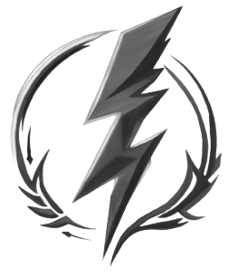

<!-- PROJECT LOGO -->
<br />
<div align="center">
  <a href="https://github.com/elderfieldzeus/portfolio3.0">
    
  </a>

  <h3 align="center">Portfolio Website</h3>

  <p align="center">
    A personal portfolio website showcasing my skills, projects, and experience.
    <br />
    <br />
    <a href="https://elderfieldzeus.vercel.app">Visit Site</a>
  </p>
</div>

<!-- ABOUT THE PROJECT -->
## About The Project

This is my personal portfolio website built using **TypeScript**, **Next.js**, and **TailwindCSS**. The website serves as a digital business card, highlighting my development skills, projects, and experience. It provides a responsive and visually appealing interface where potential employers or collaborators can learn more about my work and get in touch. The site features sections such as "About Me," "My Projects," and "Contact," providing a comprehensive view of my professional profile.

<p align="right">(<a href="#readme-top">back to top</a>)</p>

### Built With

* [](https://www.typescriptlang.org/)
* [](https://nextjs.org/)
* [](https://tailwindcss.com/)

<p align="right">(<a href="#readme-top">back to top</a>)</p>

<!-- GETTING STARTED -->
## Getting Started

To get a local copy of the project up and running, follow these simple steps.

### Installation

1. Clone the repository:
   ```sh
   git clone https://github.com/elderfieldzeus/twerkout.git
   ```
2. Install the required `bun` packages:
   ```sh
   bun install
   ```
3. Start the application:
    ```sh
    bun run dev
    ```
4. Open your browser and visit the appropriate localhost port (in this case: <a>localhost:5173</a>).

<!-- LICENSE -->
## License

Distributed under the MIT License. See `LICENSE.txt` for more information.

<p align="right">(<a href="#readme-top">back to top</a>)</p>

<!-- CONTACT -->
## Contact

Your Name - [zdelderfield.work@gmail.com](mailto:zdelderfield.work@gmail.com)

Project Link: [https://github.com/elderfieldzeus/portfolio3.0](https://github.com/yourusername/portfolio)

<p align="right">(<a href="#readme-top">back to top</a>)</p>

<!-- ACKNOWLEDGMENTS -->
## Acknowledgments

* [Best-README-Template](https://github.com/othneildrew/Best-README-Template)  
  A great template that helped structure this README file.

<p align="right">(<a href="#readme-top">back to top</a>)</p>